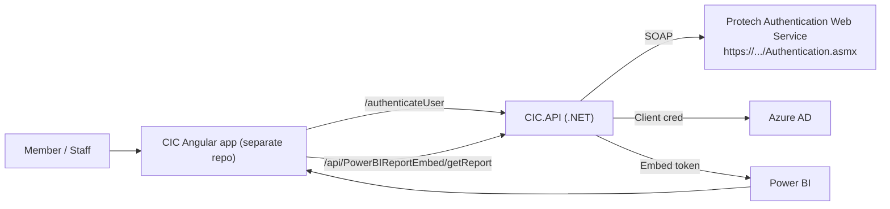
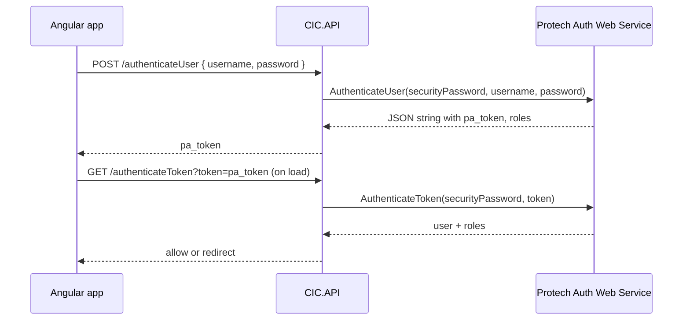
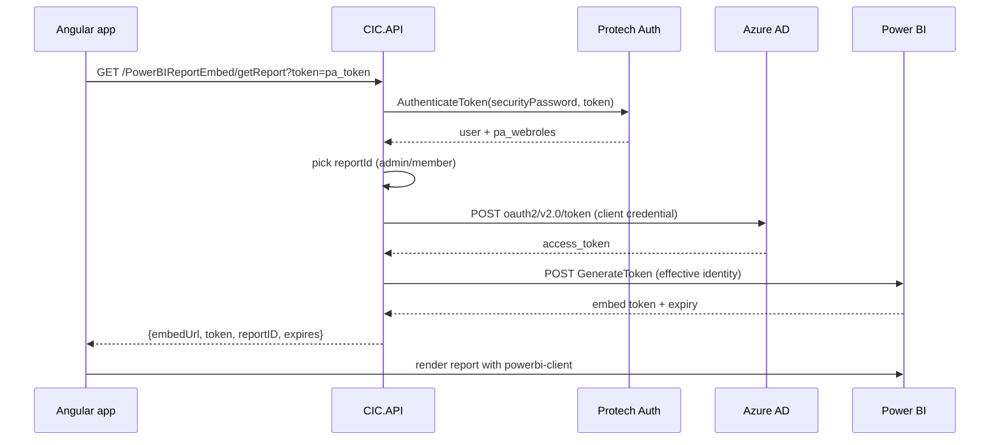

# CIC Integrations (Protech CRM + Power BI)

Backend API that sits between Protech CRM (ptassoc.com) authentication services and embedded Power BI reporting. The same API is consumed by the Angular UI (`CIC-frontend` and the `client-app` that ships inside this repo).

## For business managers
- Protech sign-on: validates members via Protech CRM (SOAP) and issues a short-lived `pa_token`.
- Access control: only authenticated members with the right Protech web roles can open analytics; others see a friendly error.
- Power BI delivery: serves the correct report (admin vs member) and applies institution-level filtering so users only see their own data.
- Deployable: works against staging (`cicstagednn1.pcsbcloud.com`) or production by configuration only—no code changes.

### System map


## How the integrations work (technical)

### Protech (ptassoc) authentication
- Endpoint: `POST /authenticateUser`  
  - Controller: `ICICCRM4MAuthenticationController.Login`  
  - Service: `CICCRM4MAuthenticationService.AuthenticateUserAsync` calls Protech SOAP `AuthenticateUser` with `securityPassword`, username, password, returns `pa_token` and web roles.
- Token validation: `GET /authenticateToken?token=...` calls Protech SOAP `AuthenticateToken`.
- Session cleanup: `GET /deleteUserSession?token=...` calls Protech SOAP `DeleteUserSession`.
- SOAP client: generated in `Connected Services/CRM4MServiceReference`, endpoint defaults to `https://my.cic.edu/DesktopModules/MX/Authentication.asmx` and is overridden at runtime to staging in `Program.cs`.

#### Authentication flow (visual)


### Power BI embedding
- Endpoint: `GET /api/PowerBIReportEmbed/getReport?token=...`
- Steps implemented in `PowerBIReportEmbedController` and `PowerBIService`:
  1) Validate `token` against Protech (`AuthenticateToken`) to get roles and email.
  2) Choose report ID: admin vs member based on Protech web roles (`PowerBISettings.AdminRoleId` / `MemberRoleId`).
  3) Acquire Azure AD app token (client credentials) via `AuthenticateAsync()`.
  4) Generate embed token with effective identity (user email/role) and dataset (`PowerBISettings.DataSets`).
  5) Return `EmbeddedReportConfig` with `embedUrl`, `token`, expiration, and `ShowReport=true`; UI uses `powerbi-client` to render.
- Filtering: controller appends filter/query string `filter=<FilterName> eq 1&filterPaneEnabled={true|false}` and sets default page `1. Home`.

#### Power BI flow (visual)


## Configuration
Add the following sections to `appsettings.{Environment}.json` (secrets should be stored in user secrets or KeyVault):

```json
"PowerBISettings": {
  "AuthorityUri": "https://login.microsoftonline.com",
  "TenantId": "<aad-tenant-guid>",
  "ClientId": "<pbi-azure-app-id>",
  "ClientSecret": "<pbi-azure-app-secret>",
  "Granttype": "client_credentials",
  "Scope": "https://analysis.windows.net/powerbi/api/.default",
  "GroupId": "<pbi-workspace-guid>",
  "ReportIdAdminRole": "<pbi-report-guid-for-admin>",
  "ReportIdUserRole": "<pbi-report-guid-for-member>",
  "AdminRoleId": "<protech-webrole-id-for-admin>",
  "MemberRoleId": "<protech-webrole-id-for-member>",
  "DataSets": "<pbi-dataset-guid>",
  "SecurityPassword": "<protech-shared-secret>",
  "FilterName": "pa_member",
  "FilterPaneEnabled": false
},
"AzureAd": {
  "TenantId": "<aad-tenant-guid>",
  "Audience": "<api-app-id-uri>"
}
```

Other settings:
- Protech SOAP endpoint override is set in `Program.cs` (`cicstagednn1.pcsbcloud.com`). Change this if you need another environment.
- CORS is currently `AllowAnyOrigin` for ease of embedding; tighten for production.

## API surface
- `POST /authenticateUser` → returns `pa_token`, roles (Protech).
- `GET /authenticateToken?token=...` → validates token (Protech).
- `GET /deleteUserSession?token=...` → ends Protech session.
- `GET /api/PowerBIReportEmbed/getReport?token=...` → returns Power BI embed config for admin/member.

## Local development
1) Restore & run: `dotnet restore` then `dotnet run --project CIC.API`.
2) Provide valid `appsettings.Development.json` with the settings above.
3) Frontend: run the Angular app from `CIC-frontend` (or `client-app/`) and point `ConstantRoute.API_URL` to your API origin.

## Where to find more
- Angular frontend (login + embed UI): `CIC-frontend` repository.
- This backend README is the source of truth for both Protech and Power BI integration details.
